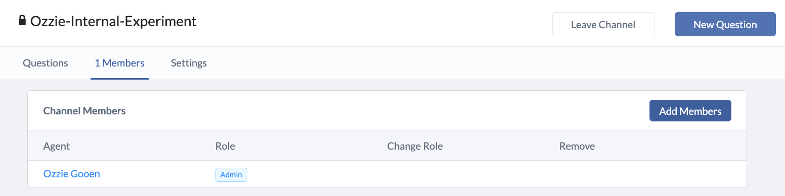

# Communities

Communities act as groups with custom membership and privacy settings. They can be useful both to organize privacy of questions and predictions, and also to organize questions into different clusters.

## Adding New Members

1. In your community page, click the "N Members" tab.
2. Click the "Add Members" button on the right side.
3. Search for the names of the users you would like to add. Click "Add to Community" next to their name.

## Community Permissions

Communities can be either private or public. If they are public, anyone can see them, including non-users of Foretold. If they are private, the contained information is only available to invited members.

A community can have multiple admins. Admins can add or remove members, convert viewers to admins, and convert admins to viewers. There must always be one admin in a community, so if you are the only admin, you cannot remove yourself from the community.

Anyone in a community can create new questions. If you would like to restrict non-admins from being able to create questions, please let message Ozzie. This feature is not yet possible but is being considered for future releases.

